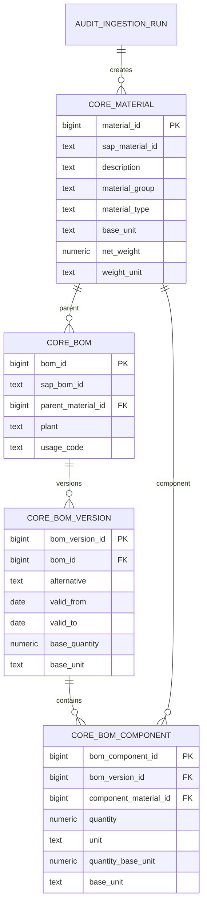
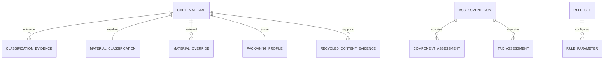

# Data model

## Core BOM model

```mermaid
erDiagram
    AUDIT_INGESTION_RUN ||--o{ CORE_MATERIAL : creates
    CORE_MATERIAL ||--o{ CORE_BOM : parent
    CORE_BOM ||--o{ CORE_BOM_VERSION : versions
    CORE_BOM_VERSION ||--o{ CORE_BOM_COMPONENT : contains
    CORE_MATERIAL ||--o{ CORE_BOM_COMPONENT : component

    CORE_MATERIAL {
        bigint material_id PK
        text sap_material_id
        text description
        text material_group
        text material_type
        text base_unit
        numeric net_weight
        text weight_unit
    }

    CORE_BOM {
        bigint bom_id PK
        text sap_bom_id
        bigint parent_material_id FK
        text plant
        text usage_code
    }

    CORE_BOM_VERSION {
        bigint bom_version_id PK
        bigint bom_id FK
        text alternative
        date valid_from
        date valid_to
        numeric base_quantity
        text base_unit
    }

    CORE_BOM_COMPONENT {
        bigint bom_component_id PK
        bigint bom_version_id FK
        bigint component_material_id FK
        numeric quantity
        text unit
        numeric quantity_base_unit
        text base_unit
    }
```

## Classification and packaging

```mermaid
erDiagram
    CORE_MATERIAL ||--o{ CLASSIFICATION_EVIDENCE : evidence
    CORE_MATERIAL ||--|| MATERIAL_CLASSIFICATION : resolves
    CORE_MATERIAL ||--o{ MATERIAL_OVERRIDE : reviewed
    CORE_MATERIAL ||--|| PACKAGING_PROFILE : scope
    CORE_MATERIAL ||--o{ RECYCLED_CONTENT_EVIDENCE : supports
    ASSESSMENT_RUN ||--o{ COMPONENT_ASSESSMENT : contains
    RULE_SET ||--o{ RULE_PARAMETER : configures
    ASSESSMENT_RUN ||--o{ TAX_ASSESSMENT : evaluates
```

The key invariant is that source facts, inferred classifications, human overrides, and policy decisions remain different records.
