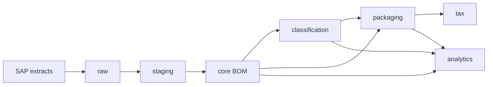

# SAP BOM Analytics

`sap-bom-analytics` converts SAP-derived Bill of Materials data into a canonical, versioned, auditable analytical model.

The pipeline is intentionally layered:



SAP remains the source system. Derived facts, classifications, review decisions, and regulatory assessments are stored separately so they can be inspected and reproduced.

## Local workflow

```bash
cp .env.example .env
make db-up
make sap-demo
```

For command-line access:

```bash
poetry run sap-bom --help
```
