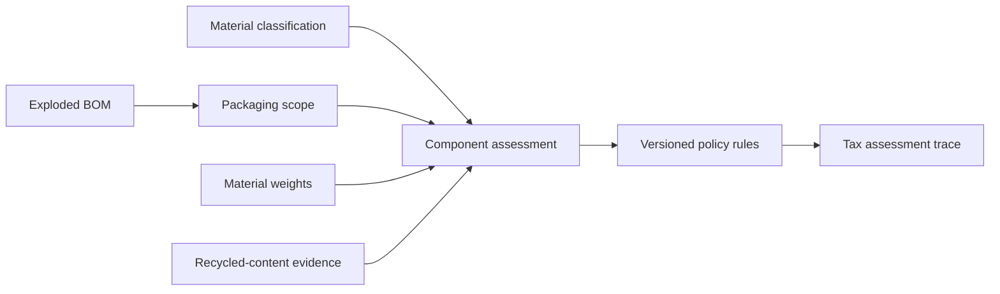

# Plastic packaging analytics

Plastic packaging assessment is downstream of the canonical BOM and material-classification layers.



The implementation keeps policy parameters outside the BOM model. The included demo rule set exists only to exercise the configurable evaluator and is not a statement of current legislation.

Useful views:

```sql
SELECT * FROM packaging.assessment_trace;
SELECT * FROM tax.assessment_trace;
SELECT * FROM analytics.product_assessment_summary;
```
